# EIOSY2A LAB - Secure Web Application Deployment

## Project Overview
This project demonstrates the complete configuration and deployment of a secure web application on openEuler Linux, covering encryption, secure communication, database management, and HTTPS implementation.

## Lab Environment
- **Server VM:** openEuler Linux
- **Client VM:** openSUSE
- **Network:** Local network / VirtualBox bridged network
- **Virtualization:** VirtualBox

## Technologies & Tools
- GPG (GNU Privacy Guard)
- OpenSSH
- MySQL Database
- Nginx Web Server
- Flask (Python)
- PHP
- OpenSSL

---
## Lab Parts

### Part 1: Working with Encryption - COMPLETED

**Date Completed:** 2025/10/01

#### Objectives
- Understand public-key cryptography fundamentals
- Generate GPG key pairs
- Encrypt and decrypt files securely

#### What I Learned
- **Encryption** converts readable data (plaintext) into unreadable code (ciphertext)
- **GPG** uses public/private key pairs:
  - **Public Key:** Can be shared - used to ENCRYPT
  - **Private Key:** Must be kept secret - used to DECRYPT
- **Passphrase:** Additional layer of security protecting the private key
- This same principle secures SSH connections and HTTPS websites

#### Commands Used
```bash
# Check GPG installation
gpg --version

# Generate key pair (2048-bit RSA)
gpg --full-generate-key

# Verify keys
gpg --list-keys

# Create test file
echo "This is sensitive lab data - Part 1 Encryption Test" > lab-secret.txt

# Encrypt file
gpg --encrypt --recipient "your_email@example.com" lab-secret.txt

# View encrypted file (binary/gibberish)
ls -l lab-secret.txt*

# Decrypt file
gpg --output lab-secret.txt --decrypt lab-secret.txt.gpg
```

#### Key Takeaways
- Encryption is the foundation of modern cybersecurity
- Public-key cryptography allows secure communication without sharing secrets
- The same principles apply to SSH (Part 2) and HTTPS (Part 5)
- Even viewing encrypted data can mess up your terminal - always use `reset` to fix it

#### Challenges Faced
- Terminal display corrupted when viewing binary encrypted file with `cat`
- **Solution:** Used `reset` command to restore terminal functionality
- **Learning:** Always use safe commands like `file` or `xxd` for binary files

#### Screenshots
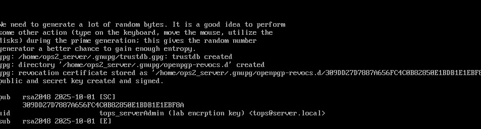

*Verified GPG 2.4.3 was installed on openEuler server*


*Successfully generated 2048-bit RSA key pair with passphrase protection*


*Created test file with readable plaintext content*

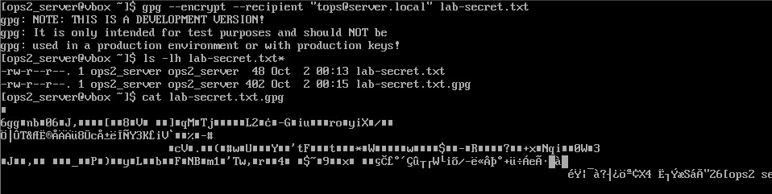

*Encrypted file is completely unreadable without the private key*

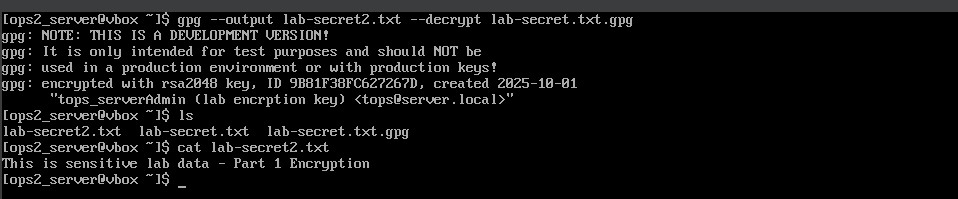

*Successfully decrypted file back to original readable format*

---

### Part 2: SSH Configuration - COMPLETED

**Date Completed:** October 1, 2025

#### Objectives
- Install and configure OpenSSH server
- Generate SSH key pairs for passwordless authentication
- Configure secure SSH settings
- Disable password-based authentication
- Implement SSH banner for security warnings

#### What I Learned
- **SSH (Secure Shell)** provides encrypted remote access to servers
- **Key-based authentication** is more secure than password authentication
- SSH uses the same public/private key cryptography principles as GPG (Part 1)
- **Public key** is stored on the server in `~/.ssh/authorized_keys`
- **Private key** remains on the client and should never be shared
- SSH configuration hardening includes disabling root login and password authentication

#### Commands Used

**Server Configuration:**
```bash
# Install OpenSSH server
sudo dnf install -y openssh-server

# Enable and start SSH service
sudo systemctl enable sshd
sudo systemctl start sshd

# Verify service status
systemctl status sshd

# Check SSH service is listening
sudo ss -tulpn | grep sshd

# Configure firewall
sudo firewall-cmd --permanent --add-service=ssh
sudo firewall-cmd --reload

# Get server IP address
hostname -I
```
**Client Configuration:**
```bash
# Generate SSH key pair (2048-bit RSA)
ssh-keygen -t rsa -b 2048 -C "your_email@example.com"

# Verify keys were created
ls -la ~/.ssh/

# Copy public key to server
ssh-copy-id username@server_ip

# Test SSH connection
ssh username@server_ip
```

**Security Hardening:**
```bash
# Backup SSH configuration
sudo cp /etc/ssh/sshd_config /etc/ssh/sshd_config.backup

# Edit SSH configuration
sudo nano /etc/ssh/sshd_config

# Modified settings:
# PermitRootLogin no
# PasswordAuthentication no
# Banner /etc/issue.net

# Restart SSH to apply changes
sudo systemctl restart sshd

# Verify configuration is valid
sudo sshd -t
```

#### Key Takeaways
- SSH key authentication eliminates password-based attacks
- Private keys should be protected with a strong passphrase
- Disabling root login prevents direct root access attempts
- Disabling password authentication forces key-based authentication only
- SSH banners provide legal warnings to potential unauthorized users
- The same encryption principles from Part 1 secure SSH connections

#### Challenges Faced
- Initial configuration had banner pointing to `/etc/issue.net` instead of custom file
- **Solution:** Used existing banner file location and customized the message
- **Learning:** Different Linux distributions may have different default SSH configurations

#### Security Improvements Implemented
- Root login disabled
- Password authentication disabled (key-based only)
- Custom security banner configured
- Firewall configured to allow SSH on port 22
- SSH keys protected with passphrase

#### Screenshots

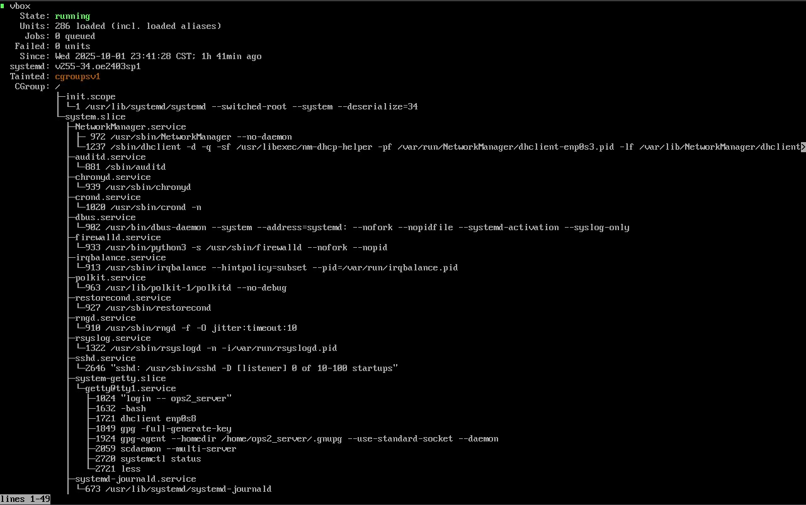
*SSH service successfully installed and running on openEuler server*

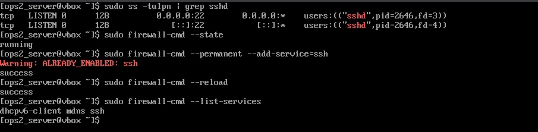
*Firewall configured to allow SSH connections*

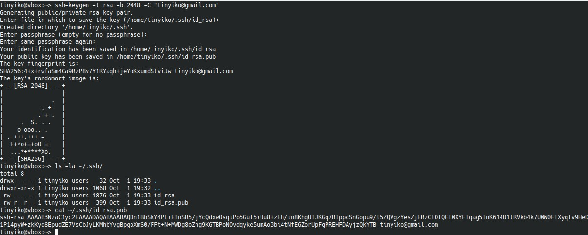
*SSH key pair generated on client with 2048-bit RSA encryption*

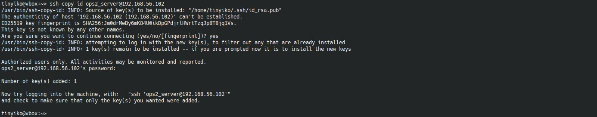
*Public key successfully copied to server's authorized_keys*

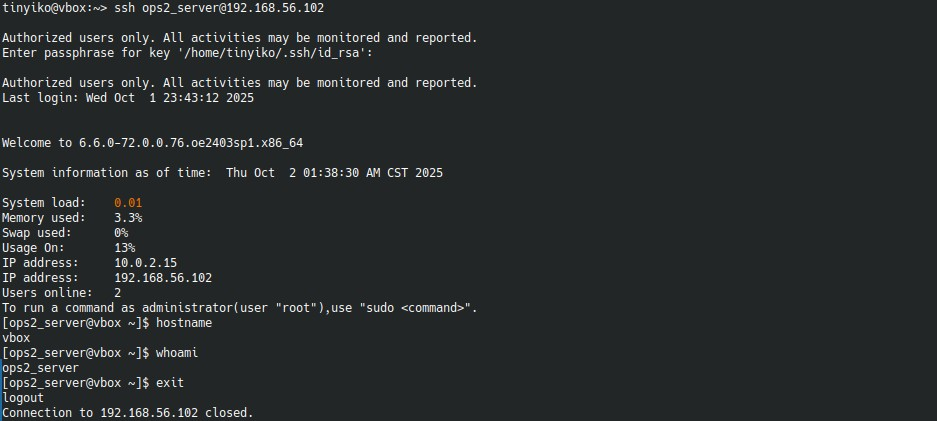
*Successful SSH connection using key-based authentication*


*SSH configuration hardened with disabled root login and password authentication*

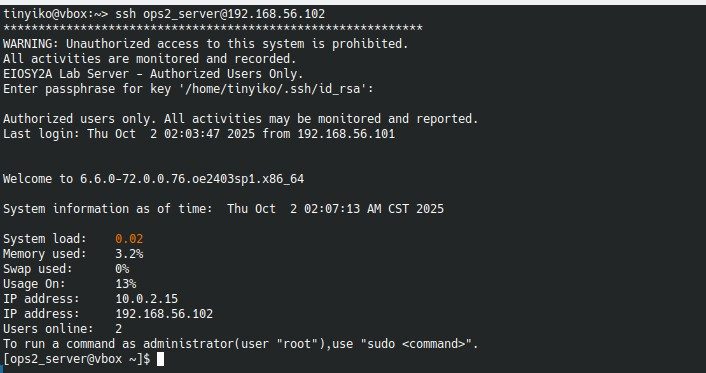
*Custom security banner displays on connection with system information*


*Password authentication properly disabled, only key-based auth allowed*


### Part 3: MySQL Database Setup - COMPLETED

**Date Completed:** October 2, 2025

#### Objectives
- Install and configure MySQL database server
- Secure MySQL installation by removing default vulnerabilities
- Create application database
- Create database users with limited privileges
- Test database connectivity and permissions

#### What I Learned
- **MySQL** is a relational database management system (RDBMS) used to store application data
- **Database users** are service accounts that applications use to connect to MySQL (different from application users stored in tables)
- **Principle of least privilege** - each application gets its own database user with minimal required permissions
- Securing MySQL involves removing anonymous users, test databases, and remote root access
- Database users should only have access to databases they need, not all databases
- Proper user separation prevents one compromised application from affecting others

#### Commands Used

**MySQL Installation:**
```bash
# Install MySQL server
sudo dnf install -y mysql-server

# Enable MySQL to start on boot
sudo systemctl enable mysqld

# Start MySQL service
sudo systemctl start mysqld

# Verify service status
systemctl status mysqld

# Check MySQL is listening on port 3306
sudo ss -tulpn | grep 3306
```

**MySQL Security Configuration:**
```bash
# Run security script to remove default vulnerabilities
sudo mysql_secure_installation

# Security steps performed:
# - Set root password
# - Remove anonymous users
# - Disable remote root login
# - Remove test database
# - Reload privilege tables

# Login to MySQL as root
sudo mysql -u root -p
```

**Database and User Setup:**
```sql
-- Login to MySQL as root
sudo mysql -u root -p

-- Create the application database
CREATE DATABASE labdb;

-- Create Flask application database user
CREATE USER 'flaskuser'@'localhost' IDENTIFIED BY 'flaskpass';

-- Create PHP application database user
CREATE USER 'phpuser'@'localhost' IDENTIFIED BY 'phppass';

-- Grant Flask user access to labdb only
GRANT ALL PRIVILEGES ON labdb.* TO 'flaskuser'@'localhost';

-- Grant PHP user access to labdb only
GRANT ALL PRIVILEGES ON labdb.* TO 'phpuser'@'localhost';

-- Apply privilege changes
FLUSH PRIVILEGES;

-- Verify databases
SHOW DATABASES;

-- Verify users
SELECT user, host FROM mysql.user;

-- Switch to labdb
USE labdb;
```

**Testing and Verification:**
```sql
-- Create test table
CREATE TABLE test_table (
    id INT AUTO_INCREMENT PRIMARY KEY,
    message VARCHAR(255),
    created_at TIMESTAMP DEFAULT CURRENT_TIMESTAMP
);

-- Insert test data
INSERT INTO test_table (message) VALUES ('Hello from MySQL!');
INSERT INTO test_table (message) VALUES ('Part 3 Database Setup');

-- Query test data
SELECT * FROM test_table;

-- Show table structure
DESCRIBE test_table;

-- Exit MySQL
EXIT;
```

**Test User Access:**
```sql
# Test Flask user can access database
mysql -u flaskuser -p
# Password: flaskpass

# Inside MySQL prompt
USE labdb;
SELECT * FROM test_table;
EXIT;

```

#### Key Takeaways
- MySQL stores application data in tables within databases
- Database users are service accounts for applications to connect, not end users of the application
- Separate database users for each application improves security through isolation
- Users should only have access to databases they need (principle of least privilege)
- mysql_secure_installation removes common security vulnerabilities
- Remote root login should be disabled to prevent unauthorized access
- Test tables verify database functionality before deploying applications

#### Challenges Faced
- Understanding the difference between database users and application users
- **Solution:** Database users authenticate applications to MySQL; application users are data stored in tables
- **Learning:** Proper user management requires understanding both types of users and their different purposes

#### Security Improvements Implemented
- Root password set and protected
- Anonymous users removed
- Remote root login disabled
- Test database removed
- Separate users created for Flask and PHP applications
- Users restricted to localhost access only
- Limited privileges granted (access to labdb only)

#### Screenshots

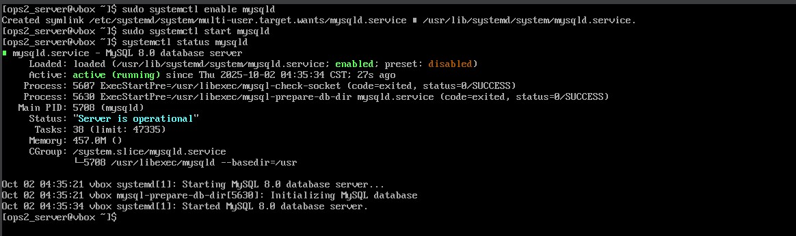
*MySQL server successfully installed and running on openEuler*

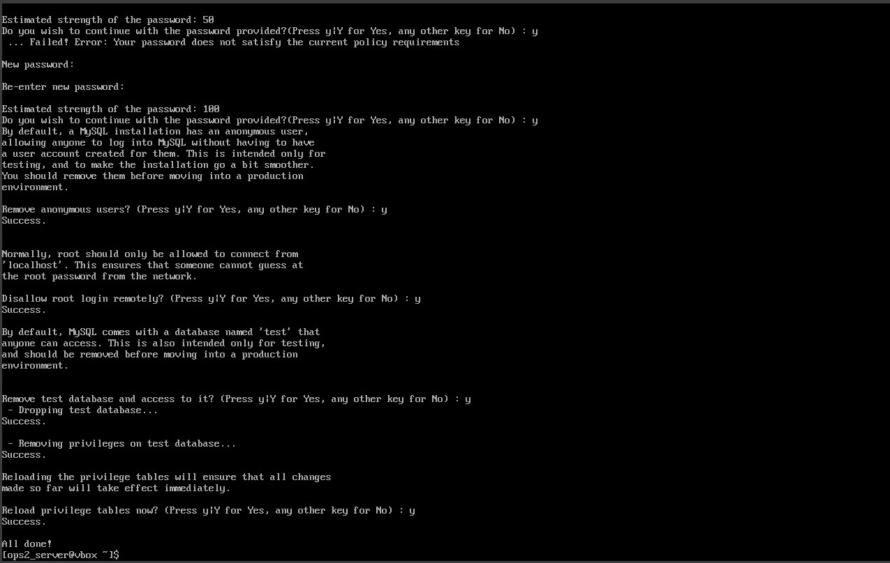
*Completed mysql_secure_installation with all security measures applied*

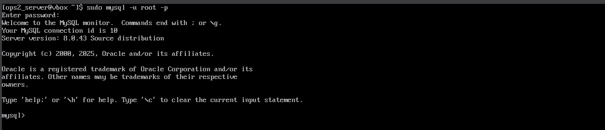
*Successfully logged into MySQL as root user*


*Created labdb database and flaskuser/phpuser accounts*

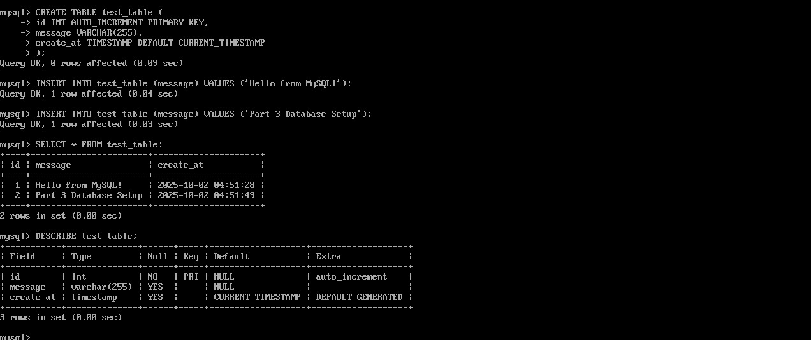
*Created test table with sample data to verify functionality*


*Verified flaskuser can successfully access and query labdb*


*Confirmed MySQL listening on port 3306*

---


### Part 4: Flask & PHP Integration - PENDING

---

### Part 5: HTTPS with SSL/TLS - PENDING

---

## Progress Tracker
- [x] Part 1: Encryption Basics
- [x] Part 2: SSH Configuration
- [x] Part 3: MySQL Setup
- [ ] Part 4: Flask & PHP Integration
- [ ] Part 5: HTTPS Configuration

---
## Key Learnings So Far

### Security Concepts
- **Confidentiality:** Encryption ensures only authorized parties can read data
- **Authentication:** Keys verify the identity of communicating parties
- **Integrity:** Encrypted data cannot be tampered with undetected

### Best Practices
- Always use strong passphrases for private keys
- Never share private keys
- Use appropriate key sizes (minimum 2048-bit for RSA)
- Store keys securely with proper file permissions

---

## Resources
- [GNU Privacy Guard Documentation](https://gnupg.org/documentation/)
- [OpenSSH Documentation](https://www.openssh.com/manual.html)
- [Nginx Documentation](https://nginx.org/en/docs/)

---

## Author Information
- **LinkedIn:** [www.linkedin.com/in/tinyikotsamane]
- **GitHub:** [https://github.com/ttsamanemashaba004]
- **Email:** [ttsamane.mashaba@gmail.com]

---

## License
This project is for educational purposes as part of the EIOSY2A course.

---

**Last Updated:** October 1, 2025  
**Status:** Parts 1-3 Complete | Part 3 In Progress