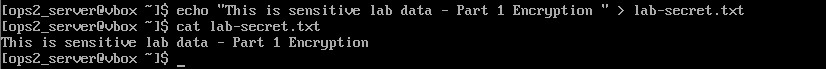

# EIOSY2A LAB - Secure Web Application Deployment

## Project Overview
This project demonstrates the complete configuration and deployment of a secure web application on openEuler Linux, covering encryption, secure communication, database management, and HTTPS implementation.

## Lab Environment
- **Server VM:** openEuler Linux
- **Client VM:** openSUSE
- **Network:** Local network / VirtualBox bridged network
- **Virtualization:** VirtualBox

## Technologies & Tools
- GPG (GNU Privacy Guard)
- OpenSSH
- MySQL Database
- Nginx Web Server
- Flask (Python)
- PHP
- OpenSSL

---
## Lab Parts

### Part 1: Working with Encryption - COMPLETED

**Date Completed:** 2025/10/01

#### Objectives
- Understand public-key cryptography fundamentals
- Generate GPG key pairs
- Encrypt and decrypt files securely

#### What I Learned
- **Encryption** converts readable data (plaintext) into unreadable code (ciphertext)
- **GPG** uses public/private key pairs:
  - **Public Key:** Can be shared - used to ENCRYPT
  - **Private Key:** Must be kept secret - used to DECRYPT
- **Passphrase:** Additional layer of security protecting the private key
- This same principle secures SSH connections and HTTPS websites

#### Commands Used
```bash
# Check GPG installation
gpg --version

# Generate key pair (2048-bit RSA)
gpg --full-generate-key

# Verify keys
gpg --list-keys

# Create test file
echo "This is sensitive lab data - Part 1 Encryption Test" > lab-secret.txt

# Encrypt file
gpg --encrypt --recipient "your_email@example.com" lab-secret.txt

# View encrypted file (binary/gibberish)
ls -l lab-secret.txt*

# Decrypt file
gpg --output lab-secret.txt --decrypt lab-secret.txt.gpg
```

#### Key Takeaways
- Encryption is the foundation of modern cybersecurity
- Public-key cryptography allows secure communication without sharing secrets
- The same principles apply to SSH (Part 2) and HTTPS (Part 5)
- Even viewing encrypted data can mess up your terminal - always use `reset` to fix it

#### Challenges Faced
- Terminal display corrupted when viewing binary encrypted file with `cat`
- **Solution:** Used `reset` command to restore terminal functionality
- **Learning:** Always use safe commands like `file` or `xxd` for binary files

#### Screenshots


*Verified GPG 2.4.3 was installed on openEuler server*


*Successfully generated 2048-bit RSA key pair with passphrase protection*



*Created test file with readable plaintext content*


*Encrypted file is completely unreadable without the private key*


*Successfully decrypted file back to original readable format*

---

### Part 2: SSH Configuration - IN PROGRESS

Coming next: Configuring secure SSH access between client and server

---

### Part 3: MySQL Database Setup - PENDING

---

### Part 4: Flask & PHP Integration - PENDING

---

### Part 5: HTTPS with SSL/TLS - PENDING

---

## Progress Tracker
- [x] Part 1: Encryption Basics
- [ ] Part 2: SSH Configuration
- [ ] Part 3: MySQL Setup
- [ ] Part 4: Flask & PHP Integration
- [ ] Part 5: HTTPS Configuration

---
## Key Learnings So Far

### Security Concepts
- **Confidentiality:** Encryption ensures only authorized parties can read data
- **Authentication:** Keys verify the identity of communicating parties
- **Integrity:** Encrypted data cannot be tampered with undetected

### Best Practices
- Always use strong passphrases for private keys
- Never share private keys
- Use appropriate key sizes (minimum 2048-bit for RSA)
- Store keys securely with proper file permissions

---

## Resources
- [GNU Privacy Guard Documentation](https://gnupg.org/documentation/)
- [OpenSSH Documentation](https://www.openssh.com/manual.html)
- [Nginx Documentation](https://nginx.org/en/docs/)

---

## Author Information
- **LinkedIn:** [www.linkedin.com/in/tinyikotsamane]
- **GitHub:** [https://github.com/ttsamanemashaba004]
- **Email:** [ttsamane.mashaba@gmail.com]

---

## License
This project is for educational purposes as part of the EIOSY2A course.

---

**Last Updated:** October 1, 2025  
**Status:** Part 1 Complete  | Part 2 In Progress 